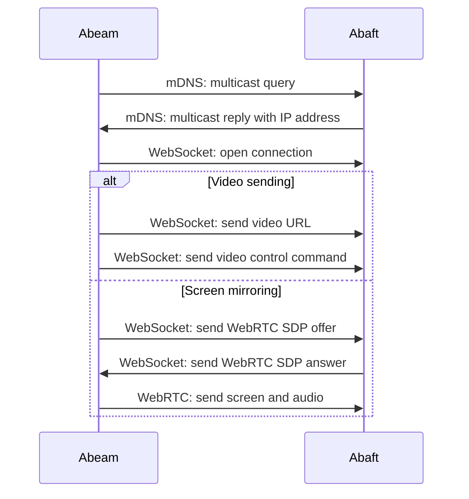

Protocol
========

The communication between Abeam and Abaft takes place over a couple of well-known transports.

* Bonjour (mDNS and DNS-SD)
* WebSocket
* WebRTC

Theoretically, any system that can speak these protocols can communicate with an instance of Abeam or Abaft.

Communications are not encrypted or authenticated. These programs assume the user’s local network is trusted.

Theoretically, any system that can speak these protocols can communicate with an instance of Abeam or Abaft.

Browser peers
-------------

There are a few limitations with implementations of these protocols in web browsers that may affect your ability to create a compatible Abeam or Abaft implementation. If you want to build a compatible Abeam or Abaft, consider whether these will be problems for you too.

**WebSocket:** Browsers require WebSocket connections to be secured with TLS, and this isn’t something that’s straightforward to set up in a local network without some kind of authority all the machines already trust.

**WebRTC and private IP addresses:** Chrome masks private IP addresses in the WebRTC SDP messages.[^1] Although this should be supported as of Safari 74[^2], I had trouble establishing a connection between Chrome and a WebKit web view. I don't have more detailed notes on hand for why this was the case.

These are problems I ran into with my initial web-based implementations of Abaft and Abeam. They’re a big part of the reason these are now implemented as native apps.

These limitations probably don’t apply to Electron apps.

[^1]: https://groups.google.com/a/chromium.org/g/blink-dev/c/z5hSy6Rf_aE/m/u3MPuMYZGAAJ
[^2]: https://developer.apple.com/documentation/safari-technology-preview-release-notes/stp-release-74
