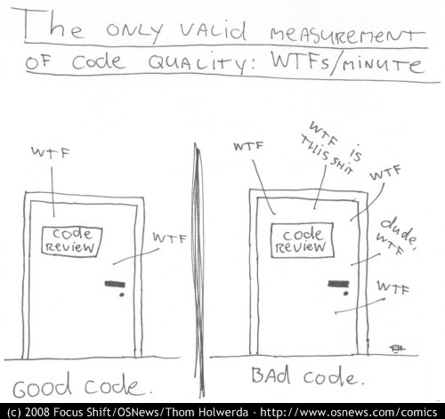

WTFs
====

This page describes patterns and practices that recur through the codebase and may be confusing. These generally aren't inline comments because there's no single obvious place to put them.

Glossary
--------

<dl>
    <dt>Abaft
    <dd>The internal name of Abeam Receiver. Internal references to Abeam Receiver use the name "Abaft" because it's short, hard to confuse with "Abeam", and contains no spaces.
    <dt>Blittie
    <dd>The original name of Abeam. This name lives on as the name of the Bonjour service `_blittie-screen._tcp`.
</dl>

Conditional compilation
-----------------------

This pattern appears throughout the code.

    #if canImport(ScreenCaptureKit)

Abeam has minimum deployment targets of macOS 26 and iOS 27. ScreenCaptureKit is available in both.

However, ScreenCaptureKit is not available in Simulators. As a result, Abeam has fallback behaviour when ScreenCaptureKit isn't available.
